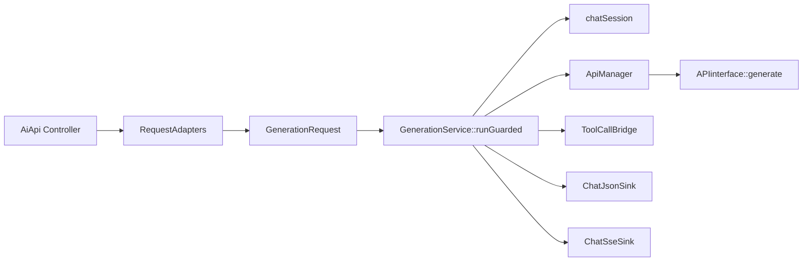
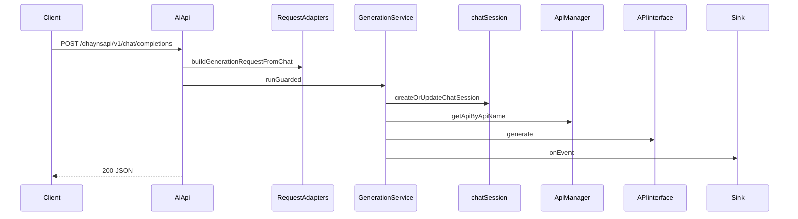

# aiapi（aiapi/src）调用关系图 / 时序图 / 接口样例（模块拆解）

> 目标：帮助协作接手者快速理解 aiapi 的核心调用链路、会话机制、并发门控、tool-call bridge，以及提供可直接运行的接口请求样例（curl）。

---

## 1. 总览：aiapi 做什么

aiapi 是一个基于 **Drogon（C++ Web 框架）** 的服务，提供两套与 OpenAI 兼容的接口：

- **Chat Completions 兼容接口**
  - `POST /chaynsapi/v1/chat/completions`
  - `GET  /chaynsapi/v1/models`

- **OpenAI Responses API 兼容接口**
  - `POST   /chaynsapi/v1/responses`
  - `GET    /chaynsapi/v1/responses/{response_id}`
  - `DELETE /chaynsapi/v1/responses/{response_id}`

此外包含后台管理接口：

- 账号管理：`/aichat/account/*`
- 渠道管理：`/aichat/channel/*`

内部核心设计：

- 统一的请求适配层：`RequestAdapters`（HTTP JSON → `GenerationRequest`）
- 统一的生成编排：`GenerationService::runGuarded()`（含并发门控、provider 调用、输出事件、tool-call bridge、会话写回）
- 会话追踪：`chatSession`（Hash 或 ZeroWidth 零宽字符两种模式）
- Provider 抽象：`APIinterface` + `ApiManager/ApiFactory` 管理

---

## 2. 模块拆解（目录结构 → 职责）

### 2.1 controllers/
- **AiApi.h / AiApi.cc** - Drogon 路由定义与业务入口
- **controllers/sinks/** - 将 GenerationService 的事件输出转换为具体协议
  - `ChatJsonSink`：ChatCompletions 非流式 JSON
  - `ChatSseSink`：ChatCompletions SSE
  - `ResponsesSseSink`：Responses SSE

### 2.2 sessionManager/
- **RequestAdapters** - Chat/Responses 两套输入格式解析为统一 GenerationRequest
- **GenerationService** - 新主入口：runGuarded(GenerationRequest, sink, policy)
- **Session（chatSession）** - 会话存储与追踪模式
- **ToolCallBridge + XmlTagToolCallCodec** - 工具调用桥接

### 2.3 apipoint/
- **APIinterface**：Provider 抽象
- **ProviderResult**：结构化 provider 返回

### 2.4 apiManager/
- **ApiFactory**：provider 注册 + 实例化
- **ApiManager**：apiName → API 实例

### 2.5 accountManager/ channelManager/ dbManager/
- 管理账号/渠道（内存 + DB）

### 2.6 核心数据结构

#### GenerationRequest
```cpp
struct GenerationRequest {
    std::string sessionKey;
    std::string previousKey;
    std::string responseId;
    Json::Value clientInfo;
    std::string provider;
    std::string model;
    std::string systemPrompt;
    std::vector<Message> messages;
    std::string currentInput;
    std::vector<ImageInfo> images;
    Json::Value tools;
    std::string toolChoice;
    bool stream = false;
    OutputProtocol protocol;
};
```

#### Message
```cpp
struct Message {
    MessageRole role;
    std::vector<ContentPart> content;
    std::vector<Json::Value> toolCalls;
    std::string toolCallId;
};
```

---

## 3. 启动流程（main.cc）

1) `drogon::app().loadConfigFile("../config.json")`
2) 读取 session_tracking.mode
3) 注册 CORS
4) 初始化：ChannelManager、AccountManager、ApiManager
5) `drogon::app().run()`

---

## 4. 调用关系图



---

## 5. 时序图

### 5.1 Chat Completions（非流式）


---

## 6. 接口样例（curl）

### 6.1 Chat Completions
```bash
curl -sS "http://127.0.0.1:5555/chaynsapi/v1/chat/completions" \
  -H 'Content-Type: application/json' \
  -d '{"model":"GPT-4o","messages":[{"role":"user","content":"Hi"}]}'
```

### 6.2 Models
```bash
curl -sS "http://127.0.0.1:5555/chaynsapi/v1/models"
```

### 6.3 Responses API
```bash
curl -sS "http://127.0.0.1:5555/chaynsapi/v1/responses" \
  -H 'Content-Type: application/json' \
  -d '{"model":"GPT-4o","input":"Hello"}'
```

---

## 7. 关键实现细节

1) Chat stream 当前先收集再分段发送
2) Responses stream 在 Controller 手写 event 序列
3) ZeroWidth 会话追踪 - 零宽字符编码 sessionId
4) Tool-call bridge - supportsToolCalls=false 时启用
5) strict tool client 兼容 - 自动包装 attempt_completion

---

## 8. 核心类说明

### 8.1 RequestAdapters
- buildGenerationRequestFromChat()
- buildGenerationRequestFromResponses()

### 8.2 GenerationService
- runGuarded(): 主入口
- materializeSession(): GenerationRequest → session_st

### 8.3 IResponseSink
- onEvent()
- onError()
- onComplete()

### 8.4 ToolCallBridge
- 请求侧：注入 tool definitions
- 响应侧：解析 XML 工具调用

---

## 9. 下一步建议

- 补充 dbManager schema
- 实现真正 streaming
- 统一 Responses 流式输出
