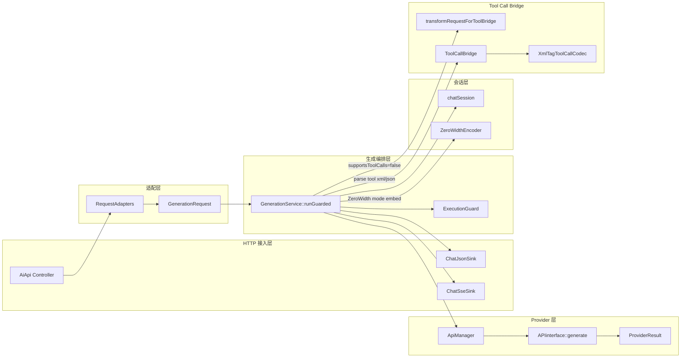
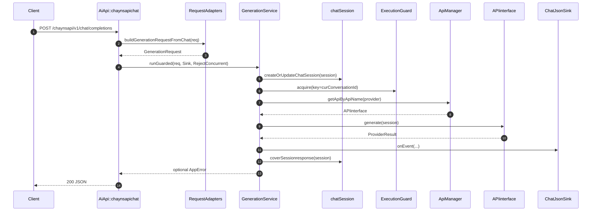
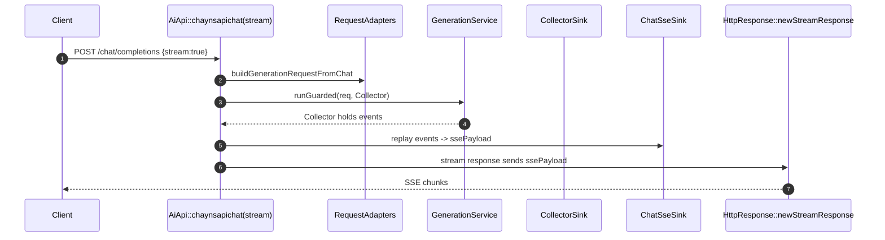
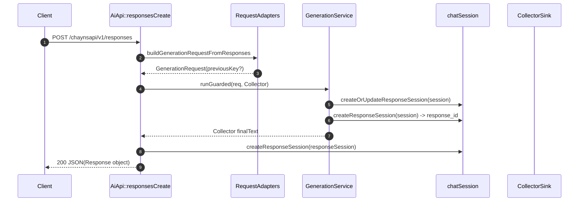

# aiapi（aiapi/src）调用关系图 / 时序图 / 接口样例（模块拆解）

> 目标：帮助协作接手者快速理解 aiapi 的核心调用链路、会话机制、并发门控、tool-call bridge，以及提供可直接运行的接口请求样例（curl）。

---

## 1. 总览：aiapi 做什么

aiapi 是一个基于 **Drogon（C++ Web 框架）** 的服务，提供两套与 OpenAI 兼容的接口：

- **Chat Completions 兼容接口**
  - `POST /chaynsapi/v1/chat/completions`
  - `GET  /chaynsapi/v1/models`

- **OpenAI Responses API 兼容接口**
  - `POST   /chaynsapi/v1/responses`
  - `GET    /chaynsapi/v1/responses/{response_id}`
  - `DELETE /chaynsapi/v1/responses/{response_id}`

此外包含后台管理接口：

- 账号管理：`/aichat/account/*`
- 渠道管理：`/aichat/channel/*`

内部核心设计：

- 统一的请求适配层：`RequestAdapters`（HTTP JSON → `GenerationRequest`）
- 统一的生成编排：`GenerationService::runGuarded()`（含并发门控、provider 调用、输出事件、tool-call bridge、会话写回）
- 会话追踪：`chatSession`（Hash 或 ZeroWidth 零宽字符两种模式）
- Provider 抽象：`APIinterface` + `ApiManager/ApiFactory` 管理

---

## 2. 模块拆解（目录结构 → 职责）

### 2.1 controllers/
- **AiApi.h / AiApi.cc**
  - Drogon 路由定义与业务入口
  - 负责：请求 JSON 校验、选择 sink、调用 `RequestAdapters` & `GenerationService`
- **controllers/sinks/**
  - 将 `GenerationService` 的事件输出转换为具体协议
  - `ChatJsonSink`：ChatCompletions 非流式 JSON
  - `ChatSseSink`：ChatCompletions SSE（注意当前是“先收集再分段发送”）
  - `ResponsesSseSink`：用于 Responses SSE（项目中 Responses 的 stream 在 controller 内还有手写事件序列）

### 2.2 sessionManager/
- **RequestAdapters**
  - Chat/Responses 两套输入格式解析为统一 `GenerationRequest`
  - 提取：model、messages/input、systemPrompt/instructions、stream、tools、tool_choice
  - ZeroWidth 模式：从历史 assistant 文本中提取会话 id → `genReq.sessionKey`
- **GenerationService**
  - 新主入口：`runGuarded(GenerationRequest, sink, policy)`
  - 核心：
    - materialize：`GenerationRequest -> session_st`
    - 创建/更新会话（Chat/Response 两条分支）
    - 并发门控：ExecutionGuard
    - provider 调用：`APIinterface::generate(session)`（结构化 `ProviderResult`）
    - 输出事件：文本 / tool_calls（含 tool bridge）
    - 会话写回：Chat coverSessionresponse / Responses updateResponseSession
- **Session（chatSession）**
  - 会话存储（session_map）与追踪模式
  - Hash 模式：消息内容 SHA256 生成 key
  - ZeroWidth 模式：在输出末尾嵌入零宽字符编码的 sessionId
  - Response API：用 response_id 作为 key 管理 response session
- **ToolCallBridge + XmlTagToolCallCodec**
  - 当通道不支持原生 tool_calls 时：
    - 将工具定义注入到请求 prompt
    - 上游输出 XML 工具调用块
    - 解析回 ToolCall 事件

### 2.3 apipoint/
- **APIinterface**：Provider 抽象（对接不同上游）
  - 新接口：`generate(session_st&) -> ProviderResult`
  - 旧接口：`postChatMessage(session_st&)`（默认 generate() 会调用旧接口做兼容）
- **ProviderResult**：结构化 provider 返回（text/usage/error/statusCode）

### 2.4 apiManager/
- **ApiFactory**：provider 注册 + 实例化（函数指针 CreateApi + 宏）
- **ApiManager**：
  - apiName → API 实例
  - modelName → priority_queue（简单负载均衡框架，useCount 更新目前比较薄）

### 2.5 accountManager/ channelManager/ dbManager/
- 管理账号/渠道（内存 + DB）
- `ChannelDbManager` 被 `GenerationService` 用于判定 `supportsToolCalls`

---

## 3. 启动流程（main.cc）

1) `drogon::app().loadConfigFile("../config.json")`
2) 读取 `custom_config.session_tracking.mode`：
   - `zerowidth` / `zero_width` → ZeroWidth 模式
   - 否则 Hash 模式
3) 注册 CORS：
   - PreRouting：OPTIONS 直接 204
   - PostHandling：补 `Access-Control-Allow-Origin: *`
4) eventloop 启动后创建线程初始化：
   - `ChannelManager::init()`
   - `AccountManager::init()`
   - `ApiManager::init()`
5) `drogon::app().run()`

---

## 4. 调用关系图（模块级）



---

## 5. 时序图（关键链路）

### 5.1 Chat Completions（非流式）



### 5.2 Chat Completions（stream=true）

> 注意：当前实现并非实时边生成边推送。AiApi 内部先用 `CollectorSink` 收集全部事件，再由 `ChatSseSink` 生成完整 SSE 文本后通过 `StreamResponse` 分段发送。



### 5.3 Responses API（非流式）



### 5.4 Responses API（stream=true）

> Responses 的流式在 AiApi.cc 中手动构造了 response.created/in_progress/.../completed 序列，并按固定 chunk size 输出 delta。

---

## 6. 接口清单与请求样例（curl）

默认服务地址来自 `config.json`：监听 `0.0.0.0:5555`。

假设本地：
- `BASE_URL=http://127.0.0.1:5555`

### 6.1 Chat Completions

#### 6.1.1 非流式

```bash
curl -sS "$BASE_URL/chaynsapi/v1/chat/completions" \
  -H 'Content-Type: application/json' \
  -d ' {
    "model": "GPT-4o",
    "stream": false,
    "messages": [
      {"role":"system","content":"You are a helpful assistant."},
      {"role":"user","content":"Say hi."}
    ]
  }'
```

#### 6.1.2 流式（SSE）

```bash
curl -N "$BASE_URL/chaynsapi/v1/chat/completions" \
  -H 'Content-Type: application/json' \
  -d ' {
    "model": "GPT-4o",
    "stream": true,
    "messages": [
      {"role":"user","content":"Write a short poem."}
    ]
  }'
```

#### 6.1.3 带 tools / tool_choice（示例）

> 注意：如果对应 channel `supportsToolCalls=false`，服务会走 tool bridge：把工具定义注入 prompt，然后解析上游返回的 XML 工具调用。

```bash
curl -sS "$BASE_URL/chaynsapi/v1/chat/completions" \
  -H 'Content-Type: application/json' \
  -d ' {
    "model": "GPT-4o",
    "stream": false,
    "tool_choice": "auto",
    "tools": [
      {
        "type": "function",
        "function": {
          "name": "read_file",
          "description": "Read files from workspace",
          "parameters": {
            "type": "object",
            "properties": {
              "files": {
                "type": "array",
                "items": {
                  "type": "object",
                  "properties": {"path": {"type": "string"}},
                  "required": ["path"]
                }
              }
            },
            "required": ["files"]
          }
        }
      }
    ],
    "messages": [
      {"role":"user","content":"Please read aiapi/src/main.cc"}
    ]
  }'
```

### 6.2 Models

```bash
curl -sS "$BASE_URL/chaynsapi/v1/models"
```

### 6.3 Responses API

#### 6.3.1 创建（非流式）

```bash
curl -sS "$BASE_URL/chaynsapi/v1/responses" \
  -H 'Content-Type: application/json' \
  -d ' {
    "model": "GPT-4o",
    "stream": false,
    "instructions": "You are a helpful assistant.",
    "input": "Summarize this in one sentence: tool-call bridge."
  }'
```

#### 6.3.2 创建（流式 SSE）

```bash
curl -N "$BASE_URL/chaynsapi/v1/responses" \
  -H 'Content-Type: application/json' \
  -d ' {
    "model": "GPT-4o",
    "stream": true,
    "instructions": "You are a helpful assistant.",
    "input": "Write a short answer."
  }'
```

#### 6.3.3 续聊（previous_response_id）

> `previous_response_id` 由上一次 responses.create 返回的 `id` 提供。

```bash
curl -sS "$BASE_URL/chaynsapi/v1/responses" \
  -H 'Content-Type: application/json' \
  -d ' {
    "model": "GPT-4o",
    "stream": false,
    "previous_response_id": "resp_1730000000000_1234",
    "input": "Continue the conversation with more details."
  }'
```

#### 6.3.4 获取 / 删除

```bash
curl -sS "$BASE_URL/chaynsapi/v1/responses/resp_1730000000000_1234"

curl -sS -X DELETE "$BASE_URL/chaynsapi/v1/responses/resp_1730000000000_1234"
```

### 6.4 账号管理 API（/aichat/account/*）

#### 6.4.1 添加账号（支持 object 或 array）
字段来自 AiApi.cc：
- `apiname`、`username`、`password`
- 可选：`authtoken`、`usertobitid`、`personid`、`usecount`、`tokenstatus`、`accountstatus`、`accounttype`

```bash
curl -sS "$BASE_URL/aichat/account/add" \
  -H 'Content-Type: application/json' \
  -d '{
    "apiname": "chaynsapi",
    "username": "demo",
    "password": "secret",
    "authtoken": "",
    "usertobitid": 0,
    "personid": "",
    "usecount": 0,
    "tokenstatus": false,
    "accountstatus": true,
    "accounttype": "free"
  }'
```

#### 6.4.2 查询账号（内存态）

```bash
curl -sS "$BASE_URL/aichat/account/info"
```

#### 6.4.3 查询账号 DB（dbinfo）

```bash
curl -sS "$BASE_URL/aichat/account/dbinfo"
```

#### 6.4.4 更新账号

```bash
curl -sS "$BASE_URL/aichat/account/update" \
  -H 'Content-Type: application/json' \
  -d '{
    "apiname": "chaynsapi",
    "username": "demo",
    "password": "new_secret",
    "authtoken": "new_token",
    "accountstatus": true,
    "tokenstatus": true,
    "accounttype": "paid"
  }'
```

#### 6.4.5 删除账号（支持 object 或 array）

```bash
curl -sS "$BASE_URL/aichat/account/delete" \
  -H 'Content-Type: application/json' \
  -d '{
    "apiname": "chaynsapi",
    "username": "demo"
  }'
```

### 6.5 渠道管理 API（/aichat/channel/*）

#### 6.5.1 添加渠道（目前 AiApi.cc 里按 array 遍历）
字段来自 AiApi.cc：
- `channelname`、`channeltype`、`channelurl`、`channelkey`
- 可选：`channelstatus`、`maxconcurrent`、`timeout`、`priority`、`description`、`accountcount`、`supports_tool_calls`

```bash
curl -sS "$BASE_URL/aichat/channel/add" \
  -H 'Content-Type: application/json' \
  -d '[
    {
      "channelname": "chaynsapi",
      "channeltype": "http",
      "channelurl": "http://example-upstream/api",
      "channelkey": "",
      "channelstatus": true,
      "maxconcurrent": 10,
      "timeout": 30,
      "priority": 0,
      "description": "default channel",
      "accountcount": 1,
      "supports_tool_calls": true
    }
  ]'
```

#### 6.5.2 渠道列表

```bash
curl -sS "$BASE_URL/aichat/channel/info"
```

#### 6.5.3 更新渠道（对象）

```bash
curl -sS "$BASE_URL/aichat/channel/update" \
  -H 'Content-Type: application/json' \
  -d '{
    "id": 1,
    "channelname": "chaynsapi",
    "channeltype": "http",
    "channelurl": "http://example-upstream/api",
    "channelkey": "",
    "channelstatus": true,
    "maxconcurrent": 20,
    "timeout": 30,
    "priority": 0,
    "description": "updated",
    "accountcount": 2,
    "supports_tool_calls": false
  }'
```

#### 6.5.4 更新渠道状态（按 channelname）

```bash
curl -sS "$BASE_URL/aichat/channel/updatestatus" \
  -H 'Content-Type: application/json' \
  -d '{
    "channelname": "chaynsapi",
    "status": false
  }'
```

#### 6.5.5 删除渠道（数组，按 id）

```bash
curl -sS "$BASE_URL/aichat/channel/delete" \
  -H 'Content-Type: application/json' \
  -d '[{"id": 1}]'
```

---

## 7. 关键实现细节（协作注意事项）

1) **Chat 的 stream 当前不是真实时流**
- stream=true 分支：先 Collector 收全量事件，再拼成 ssePayload，最后用 StreamResponse 分段发送。

2) **Responses 的 stream 在 Controller 手写 event 序列**
- response.created/in_progress/output_item.added/content_part.added/delta/.../completed
- 与 `GenerationService` 的事件体系是“并行存在”，后续改造要注意统一。
 意思是：

- 这个项目里“Responses API 的流式输出（stream=true）”并不是走 GenerationService 里那套统一的事件输出/输出通道（IResponseSink + GenerationEvent）来生成 SSE。
- 相反，在 `controllers/AiApi.cc` 的 `AiApi::responsesCreate` 里，代码**自己手动拼**了一整套符合 OpenAI Responses SSE 语义的事件序列（例如 `response.created`、`response.in_progress`、`response.output_item.added`、`response.content_part.added`、`response.output_text.delta`、`response.completed` 等），并用 `HttpResponse::newStreamResponse(...)` 逐段写出去。

因此说它与 `GenerationService` 的事件体系“并行存在”：
- ChatCompletions 的输出更多是依赖 `GenerationService` → sink（ChatJsonSink/ChatSseSink/CollectorSink）这条链路来组织输出。
- Responses 的 stream 则绕开了这条链路，在 Controller 里另起一套“如何把结果拆成 SSE events”的逻辑。

后续改造要注意统一的原因：
- 两套地方都在决定“流式事件长什么样/怎么分片/出错怎么发/finish_reason 怎么算”。一旦你改了 GenerationService 的事件或 tool-call 行为，Responses stream 可能不会同步更新，导致行为不一致、维护成本更高。
- 理想状态是把 Responses 的 SSE 事件生成也收敛到同一套输出层（例如用专门的 ResponsesSseSink，或让 GenerationService 直接产出与 Responses 对齐的事件）。

3) **ZeroWidth 会话追踪**
- RequestAdapters 会从历史 assistant 文本中 decode sessionId（若启用 ZeroWidth mode）
- GenerationService 输出时会把 sessionId 重新以零宽字符 append 到文本末尾

4) **Tool-call bridge 的触发条件**
- `supportsToolCalls=false` 且 `tools` 非空 且 `tool_choice != none`：
  - 注入“严格 XML tool call 输出规则”到 requestmessage
  - 响应侧解析 XML 或 JSON tool call

5) **strict tool client（Kilo-Code/RooCode）兼容逻辑**
- 若未检测到 tool call 且有普通文本，会自动包装为 `attempt_completion` tool call
- 若出现多个 tool call，会只保留第一个（满足“每轮必须且只能一个 tool call”约束）

---

## 8. 下一步建议（可选）

- 若需要“更可运行的接口契约文档”：建议补充从 `dbManager` 导出的 schema（channel/account 表结构）、以及 provider(chaynsapi) 的实际字段要求。
- 若要实现真正 streaming：需要让 provider 层输出增量事件，并让 sink 直接写出，而不是 Collector → 拼 payload。
