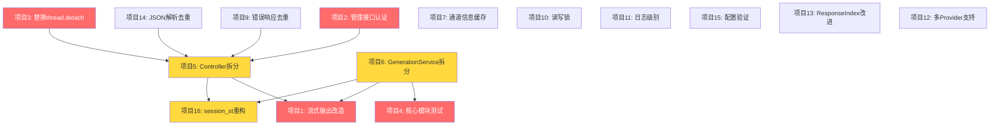

# aiapi 项目优化 — 详细开发计划

> 基于 `optimization-report.md` 中的优化建议，逐项制定详细的开发计划（已移除项目 8 密码脱敏，密码保持明文返回）。
>
> 创建日期：2026-02-07
> 基于优化报告版本：v1.1

---

## 目录

- [P0 — 必须尽快修复](#p0--必须尽快修复)
  - [项目 1：伪流式改为增量推送](#项目-1伪流式改为增量推送11)
  - [项目 2：管理接口认证](#项目-2管理接口认证41)
  - [项目 3：替换裸 thread.detach](#项目-3替换裸-threaddetach21)
  - [项目 4：增加核心模块测试](#项目-4增加核心模块测试51)
- [P1 — 短期改进](#p1--短期改进)
  - [项目 5：Controller 拆分](#项目-5controller-拆分12)
  - [项目 6：GenerationService 拆分](#项目-6generationservice-拆分13)
  - [项目 7：通道信息缓存](#项目-7通道信息缓存31)
  - [项目 9：错误响应去重](#项目-9错误响应去重22)
  - [项目 10：session_map 读写锁](#项目-10session_map-读写锁33)
  - [项目 11：日志级别调整](#项目-11日志级别调整53)
  - [项目 12：多 Provider 支持](#项目-12多-provider-支持61)
  - [项目 13：ResponseIndex 持久化与淘汰](#项目-13responseindex-持久化与淘汰62)
  - [项目 14：JSON 字段解析去重](#项目-14json-字段解析去重23)
  - [项目 15：配置验证](#项目-15配置验证52)
  - [项目 16：session_st 重构](#项目-16session_st-重构14)
- [P2 — 长期优化](#p2--长期优化)
  - [项目 17：代码风格统一](#项目-17代码风格统一25)
  - [项目 18：健康检查端点](#项目-18健康检查端点63)
  - [项目 19：全局请求限流](#项目-19全局请求限流64)
  - [项目 20：清理废弃代码](#项目-20清理废弃代码24)
  - [项目 21：StreamWriterBuilder 复用](#项目-21streamwriterbuilder-复用32)
  - [项目 22：字符串拷贝优化](#项目-22字符串拷贝优化34)
  - [项目 23：CORS 限制](#项目-23cors-限制43)
- [开发顺序建议](#开发顺序建议)
- [依赖关系图](#依赖关系图)

---

## P0 — 必须尽快修复

---

### 项目 1：伪流式改为增量推送（1.1）

**对应报告章节**：1.1 伪流式问题（P0）

**备注**：当前上游（chaynsapi）并没有流式回复，是一次性回复。因此采用方案 B/C，在轮询过程中增量推送。

#### 1.1 目标

将当前「收集全部事件 → 一次性返回」的伪流式模式，改为使用 Drogon `AsyncStreamResponse` 实现增量推送，降低首 token 延迟。

#### 1.2 涉及文件

| 文件 | 修改类型 |
|------|----------|
| `src/controllers/AiApi.cc` | 重写流式分支（约 146-241 行、1009-1120 行） |
| `src/controllers/sinks/ChatSseSink.h/cpp` | 改造为接收 `AsyncStreamWriterPtr` |
| `src/controllers/sinks/ResponsesSseSink.h/cpp` | 同上 |
| `src/sessionManager/GenerationService.h/cpp` | 调整 `runGuarded` 或增加流式入口 |
| `src/sessionManager/IResponseSink.h` | 可能需要扩展接口 |

#### 1.3 开发步骤

**步骤 1：研究 Drogon AsyncStreamResponse API**
- 阅读 Drogon 文档中 `HttpResponse::newAsyncStreamResponse()` 的用法
- 编写最小 demo 验证 AsyncStream 在当前 Drogon 版本下可用
- 确认 `AsyncStreamWriterPtr` 的线程安全语义

**步骤 2：创建 DirectSseSink 适配器**
- 新建 `src/controllers/sinks/DirectSseSink.h/cpp`
- 实现 `IResponseSink` 接口，内部持有 `drogon::AsyncStreamWriterPtr`
- `onEvent()` 方法中将 `GenerationEvent` 格式化为 SSE 帧，通过 writer 立即推送
- `onClose()` 方法关闭 writer

```cpp
// DirectSseSink.h — 接口设计
class DirectSseSink : public IResponseSink {
public:
    explicit DirectSseSink(drogon::AsyncStreamWriterPtr writer);
    void onEvent(const generation::GenerationEvent& event) override;
    void onClose() override;
private:
    drogon::AsyncStreamWriterPtr writer_;
};
```

**步骤 3：修改 Controller 流式分支**
- 在 `AiApi::chaynsapichat` 中，当 `stream=true` 时：
  1. 调用 `HttpResponse::newAsyncStreamResponse()` 获取 `writerPtr` 和 `resp`
  2. 设置 SSE 响应头（`Content-Type: text/event-stream`）
  3. 立即调用 `callback(resp)` 返回响应头
  4. 创建 `DirectSseSink(writerPtr)`
  5. 调用 `genService.runGuarded(genReq, directSink, ...)`
- 对 `AiApi::responsesCreate` 做同样改造

**步骤 4：移除 CollectorSink 复放逻辑**
- 流式分支不再需要 `CollectorSink` + 事件复放
- 保留非流式分支（`stream=false`）仍使用 `CollectorSink` → JsonSink 的路径

**步骤 5：测试验证**
- 使用 `curl --no-buffer` 验证 SSE 事件是否逐个推送
- 验证非流式请求不受影响
- 验证错误场景（provider 超时、断连）的 SSE 行为
- 验证 `CollectorSink` 路径（非流式）仍然正常

#### 1.4 验收标准

- [x] 流式请求下，客户端在 provider 返回期间就能开始收到 SSE 事件
- [x] 非流式请求行为不变
- [x] 错误场景能正确发送 SSE error 事件并关闭连接
- [x] 无内存泄漏（writer 生命周期正确管理）

#### 1.5 风险与注意事项

- Drogon AsyncStreamResponse 的版本兼容性——需确认当前使用的 Drogon 版本是否支持
- 当前 chaynsapi 是轮询方式，增量推送的最小粒度取决于轮询间隔
- 需要处理 writer 在客户端断连后的异常

---

### 项目 2：管理接口认证（4.1）

**对应报告章节**：4.1 管理接口无认证（P0）

#### 2.1 目标

为所有 `/aichat/*` 管理接口添加 API Key 认证，防止未授权访问。

#### 2.2 涉及文件

| 文件 | 修改类型 |
|------|----------|
| `src/controllers/AdminAuthFilter.h`（新建） | 认证过滤器 |
| `src/controllers/AiApi.h` | 给管理端点添加 Filter 注解 |
| `src/config.json`（或 `config.yaml`） | 添加 `admin_api_key` 配置 |
| `aiapi_web/src/services/api.ts` | 前端请求添加 Authorization 头 |
| `aiapi_web/src/utils/config.ts` | 添加 API Key 配置 |

#### 2.3 开发步骤

**步骤 1：创建 AdminAuthFilter**
- 新建 `src/controllers/AdminAuthFilter.h`
- 继承 `drogon::HttpFilter<AdminAuthFilter>`
- 实现 `doFilter()` 方法：
  1. 从请求头中提取 `Authorization: Bearer <key>`
  2. 从 Drogon 自定义配置中读取 `admin_api_key`
  3. 比对 key，通过则调用 `fccb()`，否则返回 401

```cpp
// AdminAuthFilter.h — 核心实现
class AdminAuthFilter : public drogon::HttpFilter<AdminAuthFilter> {
public:
    void doFilter(const drogon::HttpRequestPtr& req,
                  drogon::FilterCallback&& fcb,
                  drogon::FilterChainCallback&& fccb) override;
};
```

**步骤 2：在配置中添加 admin_api_key**
- 在 `config.json` 的 `custom_config` 中添加：
  ```json
  "admin_api_key": "your-secret-key-here"
  ```
- 如果 key 为空或未配置，则跳过认证（向后兼容，同时在日志中输出 WARN）

**步骤 3：给管理端点添加 Filter**
- 修改 `AiApi.h` 中所有 `/aichat/*` 端点的注册宏，添加 `"AdminAuthFilter"`：
  ```cpp
  ADD_METHOD_TO(AiApi::accountAdd, "/aichat/account/add", Post, "AdminAuthFilter");
  ADD_METHOD_TO(AiApi::channelAdd, "/aichat/channel/add", Post, "AdminAuthFilter");
  // ... 所有 /aichat/* 端点
  ```
- AI 核心 API（`/chaynsapi/*`）不添加 Filter，保持原有认证方式

**步骤 4：更新前端**
- 在 `aiapi_web/src/utils/config.ts` 中添加 API Key 配置项
- 在 `aiapi_web/src/services/api.ts` 中，所有请求添加 `Authorization: Bearer <key>` 头
- 在前端设置页面添加 API Key 输入框

**步骤 5：测试**
- 无 Authorization 头访问管理接口 → 401
- 错误 key → 401
- 正确 key → 正常访问
- AI 核心接口不受影响
- key 未配置时跳过认证（向后兼容）

#### 2.4 验收标准

- [x] 所有 `/aichat/*` 端点均需 Bearer Token 认证
- [x] `/chaynsapi/*` 端点不受影响
- [x] 前端能正常配置和使用 API Key
- [x] 未配置 key 时保持向后兼容（带 WARN 日志）
- [x] 配置示例文件（`config.example.json`）更新

---

### 项目 3：替换裸 thread.detach（2.1）

**对应报告章节**：2.1 裸线程 detach 问题（P0）

#### 3.1 目标

引入 `BackgroundTaskQueue`，替换所有 `std::thread(...).detach()` 调用，实现：
- 可控的后台线程数量
- 优雅停机（等待所有任务完成）
- 异常捕获与日志记录

#### 3.2 涉及文件

| 文件 | 修改类型 |
|------|----------|
| `src/utils/BackgroundTaskQueue.h`（新建） | 任务队列实现 |
| `src/utils/BackgroundTaskQueue.cpp`（新建） | 任务队列实现 |
| `src/controllers/AiApi.cc` | 替换 6 处 `detach()` |
| `src/main.cc` | 替换初始化 `detach()`，注册停机钩子 |
| `src/CMakeLists.txt` | 添加新文件 |

#### 3.3 开发步骤

**步骤 1：实现 BackgroundTaskQueue**

新建 `src/utils/BackgroundTaskQueue.h` 和 `.cpp`：

```cpp
// BackgroundTaskQueue.h — 接口设计
class BackgroundTaskQueue {
public:
    static BackgroundTaskQueue& getInstance();

    // 初始化工作线程（默认 2 个）
    void start(size_t workerCount = 2);

    // 提交任务
    void submit(std::function<void()> task, const std::string& taskName = "");

    // 优雅停机：等待队列清空后停止工作线程
    void shutdown();

    // 获取待处理任务数
    size_t pendingCount() const;

private:
    std::queue<std::pair<std::function<void()>, std::string>> tasks_;
    mutable std::mutex mutex_;
    std::condition_variable cv_;
    std::vector<std::thread> workers_;
    bool stopping_ = false;
    bool started_ = false;
};
```

核心行为：
- 工作线程循环取任务并执行
- 每个任务用 `try-catch` 包裹，异常记录到 `LOG_ERROR`
- `shutdown()` 设置停止标志，唤醒所有工作线程，`join()` 等待完成

**步骤 2：替换 AiApi.cc 中的 detach**

逐一替换 6 处 `std::thread(...).detach()`：

| 位置 | 原代码 | 替换为 |
|------|--------|--------|
| `AiApi.cc:317-333` | `addAccountThread.detach()` | `BackgroundTaskQueue::getInstance().submit(...)` |
| `AiApi.cc:447-464` | `deleteAccountThread.detach()` | 同上 |
| `AiApi.cc:542-544` | 匿名 thread detach | 同上 |
| `AiApi.cc:689-691` | 匿名 thread detach | 同上 |
| `AiApi.cc:805-811` | accountRefresh detach | 同上 |
| `AiApi.cc:849-860` | autoRegister detach | 同上 |

**步骤 3：替换 main.cc 中的 detach**

```cpp
// main.cc — 替换初始化线程
app().getLoop()->queueInLoop([](){
    BackgroundTaskQueue::getInstance().start(2);
    BackgroundTaskQueue::getInstance().submit([]{
        LOG_INFO << "==================【version: 1.1】===================";
        // ... 初始化逻辑 ...
    }, "system_init");
});

// 注册优雅停机
drogon::app().registerOnTerminateAdvice([]() {
    LOG_INFO << "正在等待后台任务完成...";
    BackgroundTaskQueue::getInstance().shutdown();
    LOG_INFO << "后台任务队列已关闭";
});
```

**步骤 4：更新 CMakeLists.txt**
- 将 `utils/BackgroundTaskQueue.cpp` 添加到源文件列表

**步骤 5：测试**
- 验证所有后台任务正常执行（账号添加/删除/刷新等）
- 验证优雅停机：发送 SIGTERM 后程序等待任务完成再退出
- 验证异常捕获：模拟任务异常，确认日志记录且不影响其他任务

#### 3.4 验收标准

- [x] 项目中不存在任何 `thread(...).detach()` 调用
- [x] 后台任务正常执行，功能不变
- [x] 收到 SIGTERM 时，程序等待当前执行中的任务完成后退出
- [x] 任务中的异常被捕获并记录到日志
- [x] 可通过日志观察任务提交和完成

---

### 项目 4：增加核心模块测试（5.1）

**对应报告章节**：5.1 测试覆盖率极低（P0）

#### 4.1 目标

为关键业务模块补充单元测试，建立回归防护网。分三阶段实施。

#### 4.2 涉及文件

| 文件（新建） | 测试目标 |
|-------------|----------|
| `src/test/test_request_adapters.cpp` | RequestAdapters 请求解析 |
| `src/test/test_xml_tool_call_codec.cpp` | XmlTagToolCallCodec XML 解析 |
| `src/test/test_tool_call_validator.cpp` | ToolCallValidator 工具调用校验 |
| `src/test/test_generation_service_emit.cpp` | emitResultEvents 事件发射 |
| `src/test/test_normalize_tool_args.cpp` | normalizeToolCallArguments |
| `src/test/test_strict_client_rules.cpp` | applyStrictClientRules |
| `src/test/test_forced_tool_call.cpp` | generateForcedToolCall |
| `src/test/test_sinks.cpp` | Sink 输出格式验证 |
| `src/test/CMakeLists.txt` | 更新测试构建配置 |

#### 4.3 开发步骤

**第一阶段（核心）**

**步骤 1：RequestAdapters 测试**
- 测试 `buildGenerationRequestFromChat()`：
  - 标准请求（messages + model + stream）
  - 缺少 model 字段
  - messages 为空
  - content 为数组格式（含图片）
  - system role 提取
- 测试 `buildGenerationRequestFromResponses()`：
  - 字符串 input
  - 数组 input
  - 含 previous_response_id
  - 含 instructions
  - 含 tools 定义

**步骤 2：XmlTagToolCallCodec 测试**
- 测试 `encodeToolDefinitions()`：空列表、单个工具、多个工具
- 测试 XML 解析边界情况：
  - 正常 `<function_calls>` 标签
  - 嵌套标签
  - 不完整标签
  - 空参数
  - 特殊字符转义
  - 多个函数调用
  - 混合文本和函数调用

**步骤 3：ToolCallValidator 测试**
- 测试 `filterInvalidToolCalls()`：
  - 全部有效
  - 包含无效函数名
  - 参数 JSON 格式错误
  - 空 toolCalls 列表
  - 与 tools 定义不匹配

**步骤 4：emitResultEvents 测试**
- 使用 Mock Sink 捕获事件
- 测试场景：
  - 纯文本响应
  - 含 tool calls 响应
  - tool bridge 模式下的 XML 解析
  - 空响应
  - 错误响应

**第二阶段（扩展）**

**步骤 5：normalizeToolCallArguments 测试**
- 测试各种参数形状规范化：
  - 数组包裹参数
  - 嵌套对象参数
  - 缺少必填参数
  - 类型不匹配

**步骤 6：applyStrictClientRules 测试**
- 测试不同客户端类型：
  - 普通客户端（无规则）
  - strict 客户端（包装为 attempt_completion）
  - 限制单个 tool call

**步骤 7：generateForcedToolCall 测试**
- 测试 tool_choice=required 时的兜底生成
- 测试多个工具定义下的选择逻辑

**步骤 8：Sink 输出格式测试**
- ChatJsonSink / ChatSseSink 输出格式验证
- ResponsesJsonSink / ResponsesSseSink 输出格式验证

**第三阶段（集成）**

**步骤 9：端到端集成测试框架**
- 设计集成测试框架（启动 Drogon 测试服务器）
- 编写 Chat Completions 端到端测试
- 编写 Responses API 端到端测试

**步骤 10：更新 CMakeLists.txt**
- 将所有新测试文件添加到 `src/test/CMakeLists.txt`

#### 4.4 验收标准

- [x] 第一阶段 4 个测试套件全部通过
- [x] 测试可通过 `cmake --build . --target aiapi_test && ./aiapi_test` 运行
- [x] 关键路径（请求解析、XML 解析、工具校验、事件发射）有基本覆盖
- [x] 每个测试文件包含至少 5 个测试用例

---

## P1 — 短期改进

---

### 项目 5：Controller 拆分（1.2）

**对应报告章节**：1.2 Controller 层过于臃肿（P1）

#### 5.1 目标

将 1693 行的 `AiApi` Controller 拆分为 5 个独立 Controller，每个负责一个业务域。

#### 5.2 涉及文件

| 文件 | 操作 |
|------|------|
| `src/controllers/AiApiController.h/cc`（新建） | AI 核心 API |
| `src/controllers/AccountController.h/cc`（新建） | 账号管理 |
| `src/controllers/ChannelController.h/cc`（新建） | 渠道管理 |
| `src/controllers/MetricsController.h/cc`（新建） | 指标与状态 |
| `src/controllers/LogController.h/cc`（新建） | 日志查看 |
| `src/controllers/ControllerUtils.h`（新建） | 公共工具函数 |
| `src/controllers/AiApi.h/cc` | 最终删除 |
| `src/CMakeLists.txt` | 更新源文件列表 |

#### 5.3 开发步骤

**步骤 1：创建 ControllerUtils.h**
- 提取公共函数：`sendError()`, `parseJsonOrError()`, `defaultTimeRange()`
- 所有新 Controller 共用

**步骤 2：拆分 AccountController**
- 将 `accountAdd`, `accountDelete`, `accountUpdate`, `accountRefresh`, `accountAutoRegister`, `accountInfo`, `accountDbInfo` 移入
- 注册路由：`/aichat/account/*`
- 添加 `AdminAuthFilter`（项目 2 完成后）

**步骤 3：拆分 ChannelController**
- 将 `channelAdd`, `channelDelete`, `channelUpdate`, `channelUpdateStatus`, `channelInfo` 移入
- 注册路由：`/aichat/channel/*`

**步骤 4：拆分 MetricsController**
- 将 `getRequestsSeries`, `getErrorsSeries`, `getErrorsEvents`, `getErrorsEventById`, `getStatusSummary`, `getStatusChannels`, `getStatusModels` 移入
- 注册路由：`/aichat/metrics/*`, `/aichat/status/*`

**步骤 5：拆分 LogController**
- 将 `logsList`, `logsTail` 移入
- 注册路由：`/aichat/logs/*`

**步骤 6：保留 AiApiController（核心 API）**
- 保留 `chaynsapichat`, `chaynsapimodels`, `responsesCreate`, `responsesGet`, `responsesDelete`
- 注册路由：`/chaynsapi/v1/*`

**步骤 7：删除旧文件**
- 确认所有端点正常后，删除 `AiApi.h/cc`
- 更新 CMakeLists.txt

**步骤 8：全量 API 回归测试**
- 用 curl 或 Postman 逐一验证所有 25+ 个端点
- 确认路由、参数、响应格式完全不变

#### 5.4 验收标准

- [x] 5 个新 Controller 各自独立编译
- [x] 所有 API 端点行为不变（路由 + 参数 + 响应格式）
- [x] 前端 `aiapi_web` 功能正常
- [x] `AiApi.h/cc` 已删除

#### 5.5 注意事项

- 建议在项目 2（认证）之后进行，这样拆分时可以直接添加 Filter
- 拆分顺序建议：先拆最独立的（Log → Metrics → Channel → Account → AI Core）

---

### 项目 6：GenerationService 拆分（1.3）

**对应报告章节**：1.3 GenerationService.cpp 过大（P1）

#### 6.1 目标

将 2109 行的 `GenerationService.cpp` 拆分为 6 个内聚模块。

#### 6.2 涉及文件

| 文件 | 内容 | 约行数 |
|------|------|--------|
| `src/sessionManager/GenerationService.h/cpp` | 核心编排（保留） | ~400 |
| `src/sessionManager/ToolDefinitionEncoder.h/cpp`（新建） | 工具定义编码 | ~500 |
| `src/sessionManager/ForcedToolCallGenerator.h/cpp`（新建） | 强制工具调用生成 | ~250 |
| `src/sessionManager/ToolCallNormalizer.h/cpp`（新建） | 参数规范化 | ~300 |
| `src/sessionManager/BridgeXmlExtractor.h/cpp`（新建） | XML 提取辅助 | ~200 |
| `src/sessionManager/StrictClientRules.h/cpp`（新建） | 严格客户端规则 | ~100 |

#### 6.3 开发步骤

**步骤 1：提取 ToolDefinitionEncoder**
- 提取 `GenerationService.cpp:1657-2109` 的工具定义编码逻辑
- 对外暴露 `ToolDefinitionEncoder::encode()` 和 `ToolDefinitionEncoder::loadConfigFromDrogon()`
- `GenerationService::transformRequestForToolBridge()` 改为调用此模块

**步骤 2：提取 ForcedToolCallGenerator**
- 提取 `GenerationService.cpp:1110-1339` 的强制工具调用生成逻辑
- 对外暴露 `ForcedToolCallGenerator::generate()`
- `GenerationService::generateForcedToolCall()` 改为调用此模块

**步骤 3：提取 ToolCallNormalizer**
- 提取 `GenerationService.cpp:1341-1592` 的参数形状规范化逻辑
- 对外暴露 `ToolCallNormalizer::normalize()`
- `GenerationService::normalizeToolCallArguments()` 改为调用此模块

**步骤 4：提取 BridgeXmlExtractor**
- 提取 `GenerationService.cpp:27-347` 匿名命名空间中的辅助函数
- 包括 XML 解析、字符串处理等工具函数
- 保持接口为自由函数或静态方法

**步骤 5：提取 StrictClientRules**
- 提取 `GenerationService.cpp:1594-1655` 的严格客户端规则
- 对外暴露 `StrictClientRules::apply()`
- `GenerationService::applyStrictClientRules()` 改为调用此模块

**步骤 6：更新 CMakeLists.txt 和依赖**
- 添加所有新 `.cpp` 文件
- 确保编译通过

**步骤 7：运行现有测试**
- 确保 `test_continuity_resolver`, `test_response_index` 等现有测试仍然通过
- 运行功能测试验证 AI 请求正常

#### 6.4 验收标准

- [x] `GenerationService.cpp` 缩减到 ~400 行
- [x] 5 个新模块各自职责清晰，接口明确
- [x] 所有现有测试通过
- [x] AI 请求功能不受影响

---

### 项目 7：通道信息缓存（3.1）

**对应报告章节**：3.1 每次请求查数据库获取通道信息（P1）

#### 7.1 目标

消除每次 AI 请求的数据库查询，改为从内存中的 `ChannelManager` 获取通道信息。

#### 7.2 涉及文件

| 文件 | 修改类型 |
|------|----------|
| `src/channelManager/channelManager.h` | 添加 `getSupportsToolCalls()` 方法 |
| `src/channelManager/channelManager.cpp` | 实现新方法 |
| `src/sessionManager/GenerationService.cpp` | 修改 `getChannelSupportsToolCalls()` |

#### 7.3 开发步骤

**步骤 1：在 ChannelManager 中添加按名称查询方法**

```cpp
// channelManager.h — 新增
std::optional<bool> getSupportsToolCalls(const std::string& channelName) const;
```

**步骤 2：修改 GenerationService::getChannelSupportsToolCalls()**

```cpp
bool GenerationService::getChannelSupportsToolCalls(const std::string& channelName) {
    auto result = ChannelManager::getInstance().getSupportsToolCalls(channelName);
    return result.value_or(true);  // 默认支持
}
```

**步骤 3：测试**
- 验证功能不变
- 通过日志确认不再有 DB 查询

#### 7.4 验收标准

- [x] `getChannelSupportsToolCalls()` 不再访问数据库
- [x] 通道更新后内存缓存同步更新
- [x] 功能不变

---

### 项目 9：错误响应去重（2.2）

**对应报告章节**：2.2 重复的错误响应构建（P1）

#### 9.1 目标

将 15+ 处重复的错误响应构建代码提取为公共函数。

#### 9.2 涉及文件

| 文件 | 修改类型 |
|------|----------|
| `src/controllers/ControllerUtils.h`（新建） | 公共工具函数 |
| `src/controllers/AiApi.cc`（或拆分后的各 Controller） | 替换重复代码 |

#### 9.3 开发步骤

**步骤 1：创建 ControllerUtils.h**
- 实现 `controller::sendError()`
- 实现 `controller::parseJsonOrError()`
- 实现 `controller::defaultTimeRange()`
- 所有函数为 `inline` 或头文件 only

**步骤 2：替换 AiApi.cc 中的重复代码**
- 搜索所有 `error["error"]["message"]` 模式
- 逐一替换为 `controller::sendError()` 调用
- 搜索所有 `req->getJsonObject()` 并替换为 `controller::parseJsonOrError()`
- 搜索所有时间格式化代码并替换为 `controller::defaultTimeRange()`

**步骤 3：测试**
- 验证所有端点的错误响应格式不变

#### 9.4 验收标准

- [x] AiApi.cc（或各拆分 Controller）中不再有重复的错误响应构建代码
- [x] 错误响应格式完全不变

#### 9.5 注意事项

- 如果项目 5（Controller 拆分）先完成，则在各新 Controller 中直接使用
- 如果项目 5 未完成，先在 AiApi.cc 中替换

---

### 项目 10：session_map 读写锁（3.3）

**对应报告章节**：3.3 session_map 全局互斥锁（P1）

#### 10.1 目标

将 `chatSession` 的全局 `std::mutex` 替换为 `std::shared_mutex`，提高并发读性能。

#### 10.2 涉及文件

| 文件 | 修改类型 |
|------|----------|
| `src/sessionManager/Session.h` | `std::mutex` → `std::shared_mutex` |
| `src/sessionManager/Session.cpp` | 读操作使用 `shared_lock`，写操作使用 `unique_lock` |

#### 10.3 开发步骤

**步骤 1：替换锁类型**
- `Session.h:133`：`std::mutex mutex_` → `std::shared_mutex mutex_`

**步骤 2：区分读写操作**
- 读操作（`getSession`, `sessionIsExist`, `getResponseSession` 等）使用 `std::shared_lock<std::shared_mutex>`
- 写操作（`addSession`, `delSession`, `updateSession` 等）使用 `std::unique_lock<std::shared_mutex>`

**步骤 3：审查所有锁使用点**
- 逐一检查 `Session.cpp` 中所有 `std::lock_guard<std::mutex>` 或 `std::unique_lock<std::mutex>`
- 分类为读或写操作并替换

**步骤 4：测试**
- 并发读测试
- 并发读写混合测试
- 功能回归测试

#### 10.4 验收标准

- [x] 多个读操作可以并行执行
- [x] 写操作仍然独占
- [x] 无死锁或数据竞争

---

### 项目 11：日志级别调整（5.3）

**对应报告章节**：5.3 日志级别使用不当（P1）

#### 11.1 目标

将 30+ 处调试级别的 `LOG_INFO` 调整为 `LOG_DEBUG`，减少生产环境日志量。

#### 11.2 涉及文件

| 文件 | 修改类型 |
|------|----------|
| `src/sessionManager/GenerationService.cpp` | 30+ 处 LOG 级别调整 |

#### 11.3 开发步骤

**步骤 1：分类现有日志**

按照以下规则分类：

| 保持 INFO | 改为 DEBUG |
|-----------|------------|
| 请求开始/完成 | 物化 session 细节 |
| Provider 错误 | 门控获取细节 |
| 会话创建/删除 | 工具桥接注入细节 |
| 系统初始化 | XML 解析细节 |
| | 通道能力查询结果 |
| | 会话连续性决策详情 |

**步骤 2：批量替换**
- 在 `GenerationService.cpp` 中搜索所有 `LOG_INFO`
- 按分类规则逐一修改为 `LOG_DEBUG`
- 确保不遗漏，也不误改

**步骤 3：统一日志前缀**
- 将所有日志前缀统一为 `[GenerationService]`（英文）
- 移除无前缀的日志（如 `LOG_INFO << " supportsToolCalls"`）

**步骤 4：测试**
- 在 DEBUG 级别下验证所有日志正常输出
- 在 INFO 级别下验证日志量显著减少

#### 11.4 验收标准

- [x] 每个 AI 请求在 INFO 级别下产生不超过 3 条日志
- [x] DEBUG 级别下仍可看到所有详细信息
- [x] 日志前缀统一

---

### 项目 12：多 Provider 支持（6.1）

**对应报告章节**：6.1 仅支持单 Provider（P1）

#### 12.1 目标

实现通用的 OpenAI 兼容 Provider，支持直接调用标准 OpenAI API，为后续多 Provider 故障转移打基础。

#### 12.2 涉及文件

| 文件 | 操作 |
|------|------|
| `src/apipoint/openai/OpenAiProvider.h`（新建） | OpenAI 兼容 Provider |
| `src/apipoint/openai/OpenAiProvider.cpp`（新建） | 实现 |
| `src/apipoint/APIinterface.h` | 可能需要扩展接口 |
| `src/apiManager/ApiFactory.cpp` | 注册新 Provider |
| `src/config.json` | 添加 Provider 配置 |

#### 12.3 开发步骤

**步骤 1：设计 OpenAiProvider**
- 实现 `APIinterface` 接口
- 支持配置：`api_key`, `base_url`, `default_model`
- 使用 Drogon HttpClient 调用上游 API

**步骤 2：实现 generate 方法**
- 构建 OpenAI Chat Completions 请求
- 发送 HTTP 请求并解析响应
- 支持原生 tool_calls 返回
- 错误处理和重试逻辑

**步骤 3：实现辅助方法**
- `checkAlivableTokens()`：验证 API Key
- `checkModels()`：调用 `/v1/models` 获取模型列表
- `getModels()`：返回缓存的模型列表
- `transferThreadContext()`：无操作（OpenAI 无状态）

**步骤 4：注册到 ApiFactory**
- 在 `ApiFactory.cpp` 中注册 `"openai"` → `OpenAiProvider`
- 从配置文件读取 Provider 参数

**步骤 5：测试**
- 配置指向本地 mock OpenAI 服务进行测试
- 验证标准 Chat Completions 请求
- 验证 tool_calls 返回
- 验证错误处理

#### 12.4 验收标准

- [x] 可通过配置切换到 OpenAI 兼容 Provider
- [x] 支持标准 Chat Completions API 调用
- [x] 支持原生 tool_calls
- [x] 错误处理完善
- [x] 不影响现有 chaynsapi Provider

---

### 项目 13：ResponseIndex 持久化与淘汰（6.2）

**对应报告章节**：6.2 ResponseIndex 内存存储（P1）

#### 13.1 目标

为 ResponseIndex 添加 LRU 淘汰策略和 TTL 自动过期，可选数据库持久化。

#### 13.2 涉及文件

| 文件 | 修改类型 |
|------|----------|
| `src/sessionManager/ResponseIndex.h` | 添加清理配置和方法 |
| `src/sessionManager/ResponseIndex.cpp` | 实现清理逻辑 |
| `src/main.cc` | 启动定时清理任务 |

#### 13.3 开发步骤

**步骤 1：完善 cleanup 机制**
- ResponseIndex 已有 `cleanup(maxEntries, maxAge)` 方法框架
- 完善实现：按 `createdAt` 排序，删除超过 maxAge 的条目，然后按 LRU 淘汰到 maxEntries

**步骤 2：启动定时清理**
- 在 `main.cc` 中注册定时任务，每 10 分钟调用 `cleanup()`
- 使用 Drogon 的定时器 API：`app().getLoop()->runEvery(600s, ...)`

**步骤 3：添加配置项**
- 在 `config.json` 的 `custom_config` 中添加：
  ```json
  "response_index": {
      "max_entries": 200000,
      "max_age_hours": 6,
      "cleanup_interval_minutes": 10
  }
  ```

**步骤 4：可选数据库持久化**
- 新建 `src/dbManager/response/ResponseDbManager.h/cpp`
- 在 `storeResponse()` 时同步写入数据库
- 在 `tryGetResponse()` 时先查内存，miss 时查数据库
- 启动时从数据库加载到内存

**步骤 5：测试**
- 验证清理逻辑正确删除过期条目
- 验证达到 maxEntries 时正确淘汰
- 验证重启后（如有持久化）数据可恢复

#### 13.4 验收标准

- [x] ResponseIndex 内存使用有上限
- [x] 过期条目自动清理
- [x] 现有功能不受影响

---

### 项目 14：JSON 字段解析去重（2.3）

**对应报告章节**：2.3 重复的 JSON 字段解析（P1）

#### 14.1 目标

在 `Accountinfo_st` 和 `Channelinfo_st` 上添加 `fromJson()` / `toJson()` 方法，消除重复的 JSON 解析代码。

#### 14.2 涉及文件

| 文件 | 修改类型 |
|------|----------|
| `src/accountManager/accountManager.h` | 添加 `fromJson()` / `toJson()` |
| `src/channelManager/channelManager.h` | 添加 `fromJson()` / `toJson()` |
| `src/controllers/AiApi.cc` | 使用新方法替代手动解析 |

#### 14.3 开发步骤

**步骤 1：为 Accountinfo_st 添加序列化方法**
- `static Accountinfo_st fromJson(const Json::Value& json)` — 从 JSON 解析
- `Json::Value toJson() const` — 转为 JSON（密码和 authToken 保持明文返回）

**步骤 2：为 Channelinfo_st 添加序列化方法**
- 同样添加 `fromJson()` 和 `toJson()`

**步骤 3：替换 Controller 中的手动解析**
- `accountAdd` 中：`Accountinfo_st::fromJson(item)` 替代逐字段解析
- `accountUpdate` 中：同上
- `accountInfo` / `accountDbInfo` 中：`account.toJson()` 替代逐字段构建
- `channelAdd` / `channelUpdate` / `channelInfo` 中：同上

**步骤 4：测试**
- 验证 JSON 解析结果不变
- 验证 API 返回格式不变

#### 14.4 验收标准

- [x] Controller 中不再有重复的 JSON 字段逐一解析代码
- [x] API 行为完全不变

---

### 项目 15：配置验证（5.2）

**对应报告章节**：5.2 缺少配置验证（P1）

#### 15.1 目标

启动时验证配置文件，提前发现错误配置。

#### 15.2 涉及文件

| 文件 | 操作 |
|------|------|
| `src/utils/ConfigValidator.h`（新建） | 配置验证器 |
| `src/utils/ConfigValidator.cpp`（新建） | 实现 |
| `src/main.cc` | 启动时调用验证 |

#### 15.3 开发步骤

**步骤 1：实现 ConfigValidator**

```cpp
class ConfigValidator {
public:
    struct ValidationResult {
        bool valid = true;
        std::vector<std::string> errors;
        std::vector<std::string> warnings;
    };
    static ValidationResult validate(const Json::Value& config);
};
```

验证项：
- `listeners` 存在且为数组
- `db_clients` 存在且格式正确
- `session_tracking.mode` 值有效（"hash" / "zerowidth" / "zero_width"）
- `admin_api_key`（如配置了认证）不为空
- 自定义配置中的数值范围检查

**步骤 2：在 main.cc 中调用**
- 在 `drogon::app().run()` 之前调用验证
- errors → 打印并退出
- warnings → 打印并继续

**步骤 3：测试**
- 验证合法配置通过
- 验证非法配置被拒绝
- 验证 warnings 正确输出

#### 15.4 验收标准

- [x] 配置错误在启动时即被发现
- [x] 错误信息明确指出问题所在
- [x] 不影响合法配置的启动

---

### 项目 16：session_st 重构（1.4）

**对应报告章节**：1.4 session_st 结构体过于庞大（P1）

#### 16.1 目标

使用嵌套结构体组织 `session_st` 的 20+ 个字段，提高可读性。

#### 16.2 涉及文件

| 文件 | 修改类型 |
|------|----------|
| `src/sessionManager/Session.h` | 重构 `session_st` |
| `src/sessionManager/Session.cpp` | 更新字段引用 |
| `src/sessionManager/GenerationService.cpp` | 更新字段引用 |
| `src/sessionManager/RequestAdapters.cpp` | 更新字段引用 |
| `src/controllers/AiApi.cc` | 更新字段引用 |
| `src/apipoint/chaynsapi/chaynsapi.cpp` | 更新字段引用 |
| 其他所有引用 `session_st` 的文件 | 更新字段引用 |

#### 16.3 开发步骤

**步骤 1：定义嵌套结构体**

在 `Session.h` 中定义：
- `session_st::RequestData` — 请求数据（api, model, systemPrompt, message, images, tools 等）
- `session_st::ResponseData` — 响应数据（message, apiData）
- `session_st::SessionState` — 会话状态（sessionId, contextId, apiType, isContinuation 等）
- `session_st::ProviderContext` — Provider 上下文（prevProviderKey, toolBridgeTrigger, supportsToolCalls）

**步骤 2：添加兼容性别名（过渡期）**

为平滑过渡，可添加 getter/setter 或引用别名：
```cpp
// 过渡期兼容——通过引用映射到嵌套字段
std::string& selectapi = request.api;
std::string& selectmodel = request.model;
```

**步骤 3：逐文件更新引用**
- 使用 IDE 的「查找所有引用」功能
- 按文件逐一更新：`session.selectapi` → `session.request.api`
- 每更新一个文件，编译验证

**步骤 4：移除兼容性别名**
- 所有文件更新完成后，移除过渡期的别名

**步骤 5：测试**
- 全量编译通过
- 现有测试通过
- 功能回归测试

#### 16.4 验收标准

- [x] `session_st` 使用嵌套结构体组织
- [x] 所有引用更新完毕
- [x] 编译通过且测试通过
- [x] 字段命名风格统一（建议 camelCase）

#### 16.5 注意事项

- 这是影响面最大的重构，建议放在最后
- 建议在项目 6（GenerationService 拆分）之后进行
- 可分多次 PR 提交，每次更新一个嵌套结构体

---

## P2 — 长期优化

---

### 项目 17：代码风格统一（2.5）

**对应报告章节**：2.5 代码风格不统一（P2）

#### 17.1 开发步骤

1. **创建 `.clang-format` 配置文件**
   - 选择基础风格（建议 Google 或 LLVM）
   - 自定义缩进、换行等规则
   - 放置在项目根目录 `aiapi/.clang-format`

2. **移除头文件中的 `using namespace`**
   - `ApiManager.h:6`：移除 `using namespace std;`
   - `chaynsapi.h:22`：移除 `using namespace std;`
   - `APIinterface.h:8`：移除 `using namespace std;`
   - `accountManager.h:12-13`：移除 `using namespace std;` 和 `using namespace drogon;`
   - 补全所有受影响的类型前缀（`std::string`, `std::map` 等）

3. **统一命名风格**
   - 制定命名规范文档
   - 建议：变量和方法用 camelCase，类用 PascalCase，常量用 UPPER_SNAKE_CASE
   - 在后续开发中逐步统一

4. **格式化代码**
   - 运行 `clang-format -i` 对所有 `.h/.cpp` 文件格式化
   - 作为单独的「格式化」commit 提交

#### 17.2 验收标准

- [x] `.clang-format` 配置文件存在
- [x] 头文件中无 `using namespace`
- [x] 所有代码通过 clang-format 检查（当前环境未安装 clang-format，按现有风格人工检查）

---

### 项目 18：健康检查端点（6.3）

**对应报告章节**：6.3 缺少健康检查端点（P2）

#### 18.1 开发步骤

1. **添加 `/health` 端点**
   - 返回 `{"status": "ok", "version": "1.1", "uptime": <seconds>}`
   - 无需认证
   - 记录启动时间，计算 uptime

2. **添加 `/ready` 端点**
   - 检查数据库连接
   - 检查 Provider 可用性
   - 检查是否有活跃账号
   - 返回各项状态

3. **注册路由**
   - 添加到合适的 Controller（或新建 HealthController）

#### 18.2 验收标准

- [x] `GET /health` 返回 200
- [x] `GET /ready` 返回各依赖项状态
- [x] 可用于 Docker 健康检查和负载均衡器探活

---

### 项目 19：全局请求限流（6.4）

**对应报告章节**：6.4 缺少请求限流（P2）

#### 19.1 开发步骤

1. **实现令牌桶或滑动窗口限流器**
   - 新建 `src/controllers/RateLimitFilter.h`
   - 继承 `drogon::HttpFilter<RateLimitFilter>`
   - 按客户端 IP 限流
   - 可配置：每秒请求数、突发上限

2. **添加配置项**
   ```json
   "rate_limit": {
       "enabled": true,
       "requests_per_second": 10,
       "burst": 20
   }
   ```

3. **应用到 AI 核心接口**
   - `/chaynsapi/v1/chat/completions`
   - `/chaynsapi/v1/responses`

4. **测试**
   - 验证正常请求通过
   - 验证超限请求返回 429
   - 验证不同 IP 独立计数

#### 19.2 验收标准

- [x] 超限请求返回 429 Too Many Requests
- [x] 可通过配置启用/禁用
- [x] 不影响管理接口

---

### 项目 20：清理废弃代码（2.4）

**对应报告章节**：2.4 过时注释与废弃代码（P2）

#### 20.1 开发步骤

1. **删除注释掉的代码块**
   - `GenerationService.cpp:111-194`：旧 `extractXmlInputForToolCalls` 实现
   - `GenerationService.cpp:2090-2108`：注释掉的 `recordWarnStat` 调用
   - `GenerationService.cpp:1731-1737`：注释掉的 `strictToolClient` 截断逻辑

2. **修复复制粘贴错误**
   - `GenerationService.cpp:104-110`：`p2` 的查找应该是不同的模式，确认正确意图后修复

3. **删除 deprecated 方法**
   - 确认 `createNewSessionOrUpdateSession`, `gennerateSessionstByReq`, `gennerateSessionstByResponseReq` 无引用
   - 搜索项目中是否有调用
   - 确认无引用后从 `Session.h/cpp` 中删除

4. **测试**
   - 编译通过
   - 现有测试通过

#### 20.2 验收标准

- [x] 无注释掉的代码块
- [x] 无 deprecated 方法残留
- [x] 编译通过且测试通过

---

### 项目 21：StreamWriterBuilder 复用（3.2）

**对应报告章节**：3.2 JsonCpp StreamWriterBuilder 重复创建（P2）

#### 21.1 开发步骤

1. **使用 `thread_local static` StreamWriterBuilder**
   - 在 `GenerationService.cpp` 中定义：
     ```cpp
     static thread_local Json::StreamWriterBuilder compactWriter = []() {
         Json::StreamWriterBuilder w;
         w["indentation"] = "";
         return w;
     }();
     ```

2. **替换所有创建点**
   - 搜索 `StreamWriterBuilder` 的所有使用
   - 替换为共享实例

3. **测试**
   - 验证 JSON 序列化结果不变
   - 验证多线程下无问题（`thread_local` 保证）

#### 21.2 验收标准

- [x] 无重复的 `StreamWriterBuilder` 创建
- [x] JSON 序列化结果不变

---

### 项目 22：字符串拷贝优化（3.4）

**对应报告章节**：3.4 字符串拷贝过多（P2）

#### 22.1 开发步骤

1. **识别高频拷贝点**
   - `emitResultEvents` 中 `text` 多次值拷贝 → 使用 `const std::string&` 或 `std::move`
   - `materializeSession` 返回值类型 → 使用 `std::move` 或输出参数
   - `transformRequestForToolBridge` 中字符串拼接 → 使用 `reserve()` + `append()`

2. **逐一优化**
   - 优先使用 `std::move` 语义
   - 对大字符串使用 `std::string::reserve()`
   - 将值返回改为引用参数（如有必要）

3. **测试**
   - 功能不变
   - 可选：使用 perf 或 valgrind 验证内存分配减少

#### 22.2 验收标准

- [x] 关键路径无不必要的字符串拷贝
- [x] 功能不变

---

### 项目 23：CORS 限制（4.3）

**对应报告章节**：4.3 CORS 配置过于宽松（P2）

**备注**：报告标注「暂不修改」。

#### 23.1 开发步骤（如后续决定修改）

1. **在配置中添加 CORS 配置**
   ```json
   "cors": {
       "allowed_origins": ["https://your-admin-domain.com"],
       "allowed_headers": ["Content-Type", "Authorization"],
       "allowed_methods": ["GET", "POST", "DELETE", "OPTIONS"]
   }
   ```

2. **修改 main.cc 中的 CORS 处理**
   - 从配置读取允许的 origins
   - 开发环境保持 `*`
   - 生产环境使用白名单

3. **测试**
   - 验证允许的 origin 可正常访问
   - 验证未允许的 origin 被拒绝

#### 23.2 验收标准

- [x] CORS 配置可通过配置文件控制
- [x] 生产环境 origin 受限
- [x] 开发环境不受影响

---

## 开发顺序建议

基于依赖关系和风险评估，建议按以下顺序实施：

### 第一批（基础安全与稳定性）

```
项目 2: 管理接口认证      ← 安全基础，无依赖
项目 3: 替换裸 thread.detach ← 稳定性基础，无依赖
项目 9: 错误响应去重        ← 简单，后续拆分会用到
项目 14: JSON 字段解析去重   ← 简单，后续拆分会用到
```

### 第二批（架构改进）

```
/devel
```

### 第三批（功能增强）

```
项目 1: 伪流式改为增量推送   ← 依赖项目 5、6 的清晰架构
项目 15: 配置验证           ← 独立
项目 13: ResponseIndex 改进  ← 独立
项目 4: 增加核心模块测试     ← 依赖项目 6 的模块拆分
```

### 第四批（长期优化）

```
项目 16: session_st 重构     ← 最后进行，影响面最大
项目 12: 多 Provider 支持    ← 功能扩展
项目 17-23: P2 优化项        ← 按需进行
```

---

## 依赖关系图



---

> **注意**：每个项目应作为独立的 PR/MR 提交，便于 Code Review 和回滚。
> 
> 建议每完成一个项目后进行功能回归测试，确保不引入新问题。
